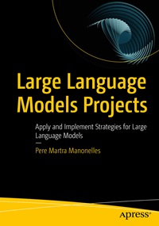

# BBAN4040 – Språkteknologi med vekt på store språkmodeller

Dette er studentrepoet for emnet Språkteknologi med vekt på store språkmodeller (BBAN4040) ved NTNU Handelshøyskolen.

Mappen `martra-notebooks/` inneholder notebooker basert på Pere Martras [*Large Language Models Projects*](https://www.link.springer.com/book/10.1007/979-8-8688-0515-8), tilpasset slik at de kan brukes i emnet.

## Martra-notebookene

Notebookene er basert på Apress sitt [GitHub-repo for boka](https://github.com/Apress/Large-Language-Models-Projects). Siden filene i Apress sitt repo ikke lenger er kjørbare på grunn av utdaterte kommandoer, ligger de i lett revidert versjon her. I denne versjonen skal alle notebookene kunne kjøres både i Google Colab og lokalt.

Last ned filene som en zip-fil ved hjelp av den grønne knappen, eller klon hele repoet til maskinen din ved hjelp av Git.
